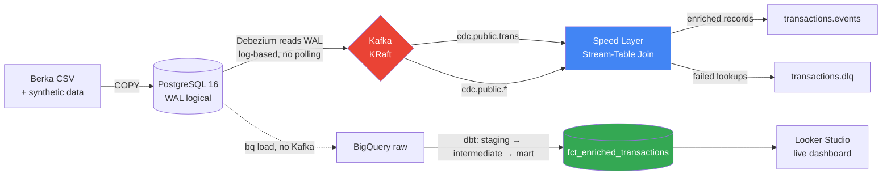
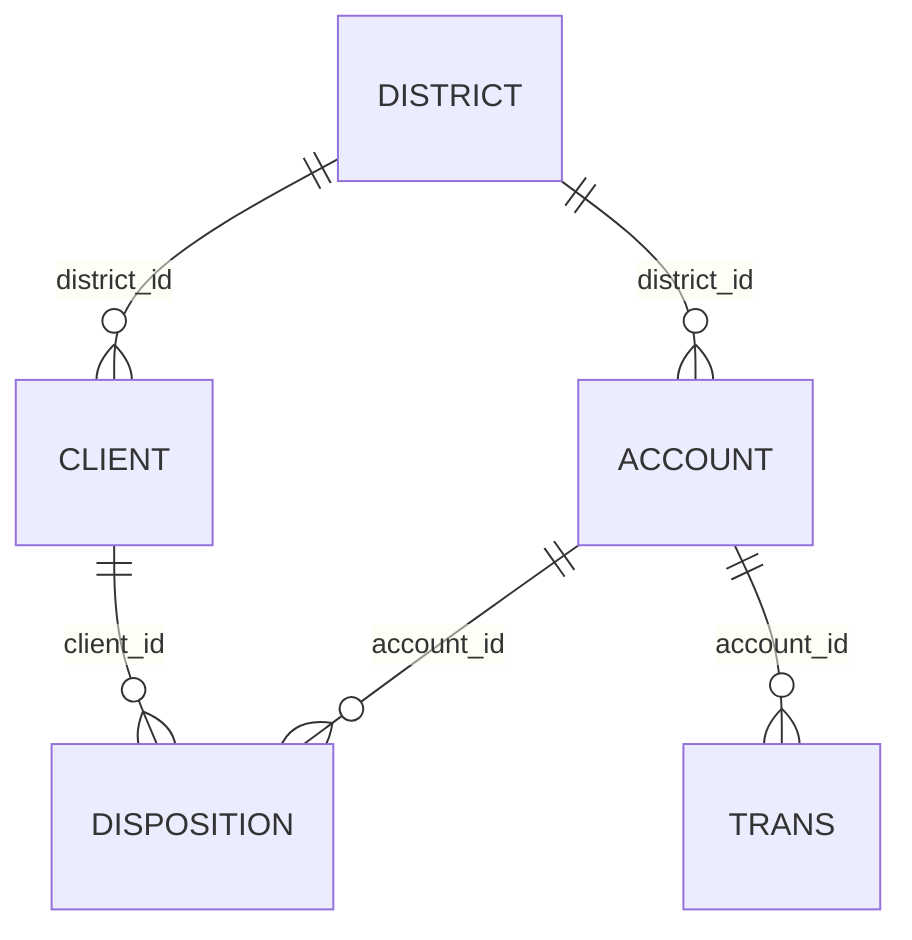

# Banking Stream-Table Join Enrichment Platform

**A CDC-based real-time transaction enrichment pipeline, built to mirror the infrastructure a bank's fraud-detection team would run before data reaches an ML model.**

High-volume transaction streams are enriched with customer profile context (region, income bracket, account tenure) at the moment they occur — not hours later in a batch job. This is the same architectural pattern (Stream-Table Join) used in production fraud detection systems, deliberately chosen over a full Lambda Architecture to reduce operational complexity while keeping real-time guarantees.

**Load-tested at 2M+ transactions on GCP.** During that test, the pipeline surfaced and I fixed a genuine data-parsing bug that only manifests outside the original dataset's date range — the kind of edge case that only shows up under real load, not in a toy demo.

[📊 Live Dashboard](https://datastudio.google.com/reporting/d385a2f5-2e41-4454-acdc-3580f5df032d) · [📄 Load Test Report](docs/load_test_results.md) · [📐 Architecture Decisions](docs/decisions/)

---

## Architecture



| Stage | Component | Role |
|---|---|---|
| 0 | `data_generation/` | Learns statistical distributions from real Berka data → generates synthetic transactions + injects controlled corruption (duplicates, referential violations, missing values) |
| 1 | PostgreSQL 16 | OLTP source of truth — 5 core banking tables, logical replication enabled |
| 2 | Debezium Connect | Log-based CDC via WAL — captures every INSERT/UPDATE, no polling overhead on the source DB |
| 3 | Kafka (KRaft) | Message broker, partitioned by primary key to preserve per-entity ordering |
| 4 | Speed Layer | Python consumer — joins transaction stream against an in-memory State Table (customer profile) in real time |
| 5 | Batch Layer | Airflow (TaskFlow API) orchestrating dbt — full reprocessing + 31 automated data-quality tests |
| 6 | BigQuery | Serving layer — the fact table both layers ultimately feed into |
| 7 | Looker Studio | Live-connected dashboard — reflects the warehouse in real time, not a static export |

<details>
<summary>📐 Database schema (click to expand ERD)</summary>



5 normalized OLTP tables flatten into 1 wide `fct_enriched_transactions` fact table at the serving layer. Full schema + design rationale: [docs/data_dictionary.md](docs/data_dictionary.md).

</details>

**Why Stream-Table Join instead of a full Lambda Architecture?** A Lambda Architecture requires two independent pipelines computing the same result and reconciling them — real operational overhead. Here, the "Table" side (customer profile) changes slowly and the "Stream" side (transactions) is append-only, so a direct join against an in-memory snapshot is sufficient — no need to recompute history to guarantee correctness. Full reasoning: [ADR 001](docs/decisions/001-stream-table-join-not-lambda.md).

---

## Results

Numbers below reflect the state **after** the 2M-row cloud load test (see [full report](docs/load_test_results.md)).

| Metric | Value |
|---|---|
| Transactions processed (Postgres) | 2,056,320 |
| CDC events captured (Kafka, 3 partitions) | ~2,056,320 |
| Speed Layer — enriched / DLQ / success rate | 776,000+ / 0 / 100% |
| Batch Layer — `fct_enriched_transactions` (post INNER JOIN) | 2,036,711 |
| Rows excluded by design (referential-violation corruption) | 19,609 (~1.96%, matches injected rate) |
| dbt models | 7 (5 staging, 1 intermediate, 1 mart) |
| dbt data tests | 31 total — 30 PASS, 1 WARN (intentional, not a failure) |
| Infra cost of full cloud load test | < $1 USD, auto-terminated VM, verified zero residual cost |

---

## Engineering Highlights — what actually went wrong, and how it was fixed

A pipeline that never breaks in front of you either wasn't tested hard enough, or the failures weren't kept. These were real, not staged:

### 1. A load test found a real data bug, not just a performance number
Scaling the dataset to 2M rows (including transactions dated 2000+, outside the original 1993–1998 Berka range) triggered `Failed to parse input string "191017"` in the batch layer. Root cause: the `date` column is stored as `INTEGER`; dates from the 2000s start with a leading zero (e.g. `001017`), which Postgres/BigQuery silently truncate to `1017` when cast to a string — breaking a century-detection heuristic that assumed a fixed 6-digit input. Fixed with `LPAD(..., 6, '0')` before the century logic runs. **This is the actual value of load testing**: the original 1M-row dataset could never have exposed this, because every date in it happens to start with `9`.

### 2. Cloud IAM has two independent permission layers — and only checking one wastes hours
Deploying a GCE VM for the load test, `dbt run` failed against BigQuery despite the service account having the correct IAM role. Turned out IAM role (logical permission) and VM OAuth scope (what APIs the instance is *physically* allowed to call) are separate control planes — the VM was created without `--scopes=cloud-platform`. Fixed by stopping the VM, updating its service account scope, and restarting. Documented so it doesn't cost another debugging session next time.

### 3. A "successful" load can still silently load nothing
After appending 1M synthetic rows to Postgres and registering the Debezium connector, Kafka offsets read `0` across all partitions — with `snapshot.mode: no_data`, Debezium only captures changes that happen *after* the replication slot exists. Loading data before registering the connector means CDC has nothing to see. Correct order: register connector → load data.

*(Full write-ups with more technical depth available on request — kept out of this README for length.)*

---

## Data Quality — controlled corruption injection

Synthetic data intentionally includes 3 categories of injected errors, so the pipeline has something real to catch — not a demo where every test trivially passes:

| Error type | Rate | Simulates | Caught by |
|---|---|---|---|
| Duplicate records | 2% | Kafka producer retry semantics | dbt `unique(trans_id)` + staging dedupe (`ROW_NUMBER`) |
| Referential violation | 2% | `account_id` with no matching account | dbt `relationships` test (warn) + excluded via `INNER JOIN` in the mart |
| Missing values | 3% | Nulls in optional fields | dbt `not_null` tests |

Every injected error is logged to [`docs/corruption_manifest.json`](docs/corruption_manifest.json) and can be cross-checked against actual test results — the corruption rate and the test failure rate should match, and they do.

---

## Delivery Semantics (honest, not glossed over)

The Speed Layer runs Kafka's consumer with default auto-commit and produces enriched records without a manual offset-commit-after-produce guarantee. This means the current implementation is **at-least-once**, not exactly-once: a crash between enrichment and produce could in theory cause a duplicate on restart. This is mitigated downstream (dbt staging dedupes by `trans_id`, and the Postgres load path uses `ON CONFLICT DO NOTHING` where duplication is expected), but it is not solved at the streaming layer itself. A production system needing exactly-once would use Kafka transactional producers with `read_committed` isolation, or Kafka Streams' exactly-once-v2. Flagging this here rather than waiting to be asked.

---

## Cost & Operational Discipline

The 2M-row load test ran on a real GCP Compute Engine VM, not just locally — with explicit cost controls, not "I'll remember to delete it":

- VM created with `--max-run-duration=2h --instance-termination-action=DELETE` — self-destructs on a timer regardless of whether anyone remembers to clean up
- Verified post-teardown with `gcloud compute instances/disks/addresses list` — confirmed zero residual billable resources
- Total infra cost for the entire load test: well under $1 USD, covered by GCP free trial credit

---

## Known Limitations / Roadmap

Being upfront about what's not done yet, in priority order:

- [ ] **Python unit tests are scaffolded but not written** (`tests/unit/`, `tests/integration/`) — the 31 "tests" referenced above are dbt SQL-based data tests, not Python unit tests. Priority: `speed_layer/enrichment.py::enrich()` first (pure function, no I/O, fast to test).
- [ ] **No CI/CD pipeline yet** — no `.github/workflows/`. Next step: a GitHub Actions workflow running `pytest` + `dbt test` on push.
- [ ] **Exactly-once delivery not implemented** — see Delivery Semantics above.
- [ ] Batch Layer re-processes the full dataset every run rather than incrementally — acceptable at current volume, would need an incremental dbt materialization strategy at larger scale.

---

## Quickstart

### Prerequisites
- Docker Desktop + WSL2
- Python 3.10+
- `kafka-python==2.0.2`, `psycopg2-binary`, `dbt-bigquery`

### 1. Clone and set up
```bash
git clone https://github.com/Nhut-Data/banking-stream-enrichment.git
cd banking-stream-enrichment
cp .env.example .env
```

### 2. Start the infrastructure
```bash
make up
docker compose ps   # wait for all services to report healthy (~1-2 min)
```

### 3. Register the CDC connector — BEFORE loading data
```bash
make register-connector
curl http://localhost:8083/connectors/berka-postgres-connector/status | python3 -m json.tool
```
> Order matters: `snapshot.mode: no_data` means Debezium only captures changes made *after* the connector exists. Loading data first means CDC will see nothing.

### 4. Load Berka data into Postgres
```bash
# Place Berka CSVs in data/raw/ — download: https://sorry.vse.cz/~berka/challenge/pkdd1999/berka.htm
make load-data
```

Optional — scale to load-test volume ([full report](docs/load_test_results.md)):
```bash
make generate            # generates data/output/trans_loadtest.csv (~1M synthetic rows)
make load-data-loadtest  # appends via staging table + ON CONFLICT DO NOTHING
```

### 5. Run the Speed Layer
```bash
echo "$(docker inspect berka-kafka --format '{{range .NetworkSettings.Networks}}{{.IPAddress}}{{end}}') kafka" | sudo tee -a /etc/hosts

docker run --rm -it \
  --network banking-platform-net \
  -e KAFKA_BOOTSTRAP_SERVERS=kafka:9092 \
  -v $(pwd)/speed_layer:/app/speed_layer \
  -w /app \
  python:3.11-slim \
  bash -c "pip install kafka-python==2.0.2 -q && python3 -m speed_layer.run"
```

### 6. Run the Batch Layer (dbt)
```bash
cd dbt
dbt run --profiles-dir .    # 7 models
dbt test --profiles-dir .   # 31 data tests
```

### 7. Orchestrate via Airflow (optional)
```bash
make up-airflow
# UI: http://localhost:8080 (airflow/airflow)
```
DAG `banking_batch_enrichment` uses the TaskFlow API (`@dag`, `@task.bash`) — Airflow 3.x's recommended pattern, not the legacy `BashOperator` style:
```bash
docker exec -it banking-stream-enrichment-airflow-scheduler-1 \
  airflow dags trigger banking_batch_enrichment
```

---

## Stack

| Layer | Technology |
|---|---|
| Source | Berka PKDD'99 dataset |
| OLTP | PostgreSQL 16 (logical replication) |
| CDC | Debezium Connect 3.0 |
| Message Broker | Confluent Kafka 7.6.1 (KRaft, no Zookeeper) |
| Stream Processing | Python + kafka-python |
| Orchestration | Apache Airflow 3.x (TaskFlow API, CeleryExecutor) |
| Transformation | dbt-bigquery 1.12 |
| Serving | Google BigQuery |
| Visualization | Looker Studio (live-connected) |
| Cloud Infra | GCP Compute Engine (load testing, cost-controlled) |
| Monitoring | Kafka UI |

---

## Architecture Decision Records

Every non-trivial design choice is documented, including the ones made under pressure while debugging:

- [ADR 001](docs/decisions/001-stream-table-join-not-lambda.md) — Stream-Table Join over full Lambda Architecture
- [ADR 002](docs/decisions/002-berka-only-no-ibm-aml.md) — Berka dataset over IBM AML / PaySim
- [ADR 003](docs/decisions/003-synthetic-data-generation.md) — Synthetic data generation to enable load testing
- [ADR 004](docs/decisions/004-deploy-once-no-cloud-sql.md) — One-time deploy, no persistent Cloud SQL
- [ADR 005](docs/decisions/005-airflow3-taskflow-migration.md) — Migrating to Airflow 3.x's TaskFlow API
- [ADR 006](docs/decisions/006-staging-table-dedup-load-test.md) — Staging table + `ON CONFLICT` for load-test dedup

---

## Project Structure
banking-stream-enrichment/
├── data_generation/ # Stage 0: synthetic data + corruption injection
├── infra/
│ ├── postgres/ # Schema SQL + load scripts (load_berka.py, load_trans_loadtest.py)
│ ├── debezium/ # Connector config
│ └── kafka/ # Topic setup
├── speed_layer/ # Stage 4: Stream-Table Join (Python)
├── dbt/
│ └── models/
│ ├── staging/ # 1:1 with sources, type casting, dedupe
│ ├── intermediate/ # Joins 4 profile tables → unified customer view
│ └── marts/ # fct_enriched_transactions
├── airflow/ # DAG orchestration (TaskFlow API)
├── docs/
│ ├── decisions/ # ADRs
│ ├── load_test_results.md
│ └── corruption_manifest.json
└── tests/ # Scaffolded, not yet implemented — see Roadmap
├── unit/
└── integration/

