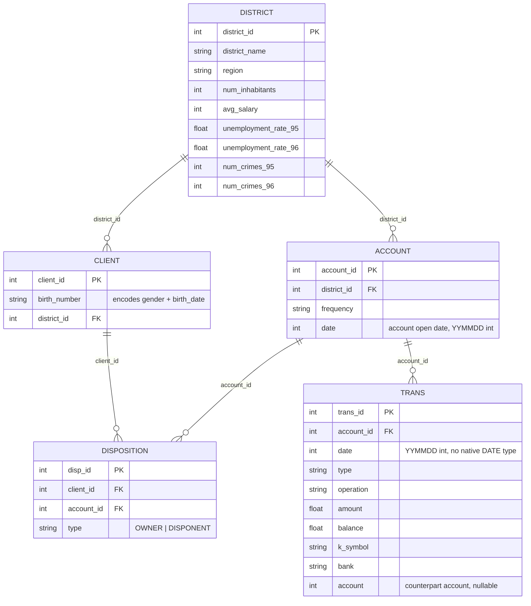
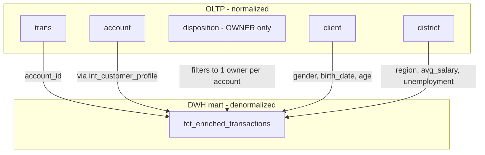

# Data Dictionary — OLTP Schema & DWH Mart

## OLTP Schema (PostgreSQL) — Entity Relationship

### Design decisions worth noting

- **`date` stored as `INTEGER` (YYMMDD), not native `DATE`** — matches the original Berka export format. This is the root cause of the date-parsing bug found during load testing (see [load test report](load_test_results.md)) — an `INTEGER` silently drops a leading zero, which a native `DATE` type never would have allowed. Kept as-is deliberately, to preserve fidelity with the source dataset and because the bug itself became a documented engineering finding.
- **`disposition.type` includes both `OWNER` and `DISPONENT`** — only `OWNER` is used downstream (see `stg_berka__disposition`), since a `DISPONENT` (secondary user) shouldn't be treated as the account's primary profile owner for enrichment purposes.
- **`client.birth_number` is a single encoded field** — Czech national ID convention encodes both gender and birth date in one number (women: month + 50). Decoded into `gender` + `birth_date` at the staging layer, not in raw Postgres.
- **`trans.account` (counterpart account) is nullable and often unpopulated** — represents the receiving/sending account in a transfer, not always known. Not used in the current mart; flagged here for future enrichment work (e.g., transfer network analysis).

---

## DWH Mart — how the OLTP schema flattens into `fct_enriched_transactions`

The serving layer intentionally denormalizes the 5 normalized OLTP tables into a single wide fact table, optimized for read/aggregation rather than write consistency — standard OLAP practice.

**`fct_enriched_transactions` final columns:**

| Column | Source | Notes |
|---|---|---|
| `trans_id`, `account_id`, `transaction_date`, `transaction_type`, `operation`, `amount`, `balance`, `k_symbol` | `trans` (via staging) | Transaction grain — 1 row per transaction |
| `client_id`, `gender`, `birth_date`, `age_at_end_of_dataset` | `client` (via `int_customer_profile`) | Decoded from `birth_number` at staging |
| `account_frequency`, `account_open_date` | `account` | |
| `district_name`, `region`, `avg_salary`, `unemployment_rate_96` | `district` | Geographic/demographic enrichment |
| `amount_to_avg_salary_ratio` | Derived | `amount / NULLIF(avg_salary, 0)` — relative transaction size vs. regional income |

**Join type: `INNER JOIN`, not `LEFT JOIN`** — a transaction whose `account_id` has no matching profile (referential-violation corruption, ~2% by design) is **excluded** from the mart rather than kept with null enrichment fields. This is a deliberate correctness-over-completeness trade-off — see [ADR](decisions/) and [load test report](load_test_results.md) for the exact row counts this produces (19,609 excluded out of 2,056,320).
